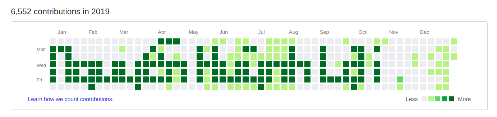
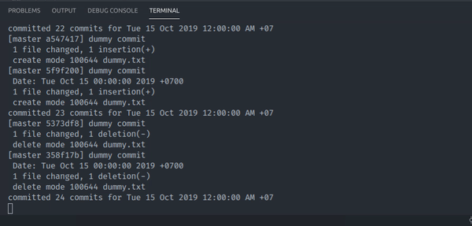

# Nguyen Huynh Loi github contributions manipulation

```
./draw_github_contributions.sh [file data] [weeks offset] [number of commits per day] 

./draw_github_contributions.sh  nguyen.txt  1              50
./draw_github_contributions.sh  huynh.txt   1              50
./draw_github_contributions.sh  loi.txt     1              50
```


- [The result](https://github.com/loia5tqd001?tab=overview&from=2019-12-01&to=2019-12-31)



- The execution



- [The dummy repo](https://github.com/loia5tqd001/Nguyen-Huynh-Loi)